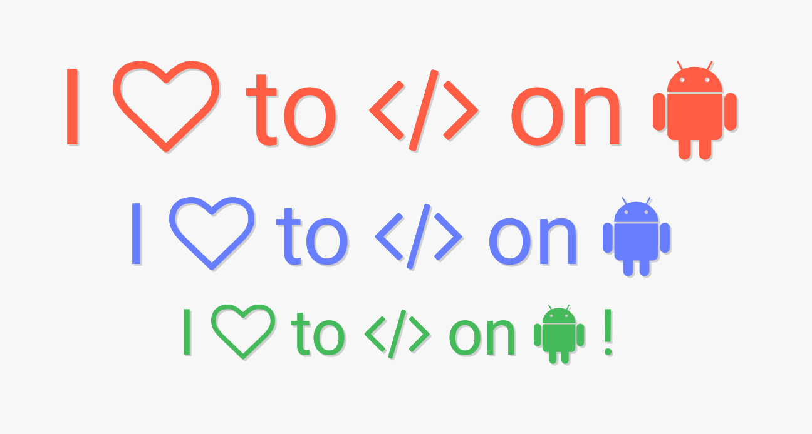

**Xamarin Iconify** is the Iconify Project converted to C# for easier usage in Xamarin Android projects.

[**Iconify**](https://github.com/JoanZapata/android-iconify) offers you a **huge collection of vector icons** to choose from, and an intuitive way to **add and customize them in your Android app**. It has been introduced in [**this blog post**](http://blog.joanzapata.com/iconify-just-got-a-lot-better/) which is a good place to get started. 


--------------
### Install

1. Pick any of the fonts provided as [nuget packages](https://www.nuget.org/packages?q=iconify) and install them into your app. For example 
    ```
    Install-Package xamarin-iconify-fontawesome
    Install-Package xamarin-iconify-ionicons 
    ```
2. Initialize Iconify with installed fonts. Initialization **has to be done before calling SetContentView method if you want to use widgets** or in any place if you just need to create some drawable. Best way is to override `Application` class:
    ```c#
    namespace XamarinIconify.Sample
    {
	    [Android.App.Application]
    	public class SampleApplication :Android.App.Application
	    {
		    public SampleApplication () : base () { }
    
	    	public SampleApplication (IntPtr javaReference, Android.Runtime.JniHandleOwnership transfer) : base (javaReference, transfer) { }
		    
		    public override void OnCreate()
		    {
			    base.OnCreate();
			    JoanZapata.XamarinIconify.Iconify
				    .With (new JoanZapata.XamarinIconify.Fonts.FontAwesomeModule ())
    				.With (new JoanZapata.XamarinIconify.Fonts.IonIconsModule ())
	    			;
		    }
	    }
    }
    ```
3. Now you can use IconTextView, IconButton, IconToggleButton in your Layout files as well as IconDrawable in your code.

### Show icons in text widgets

If you need to put an icon on a ```TextView``` or a ```Button```, use the ```{ }``` syntax with provided ```IconTextView``` and/or ```IconButton```. The icons act exactly like the text, so you can apply shadow, size and color on them:
```xml
    <JoanZapata.XamarinIconify.Widget.IconTextView
            android:text="I {fa-heart-o} to {fa-code} on {fa-android spin} {fa-refresh #00aa00 spin}"
            android:shadowColor="#22000000"
            android:shadowDx="3"
            android:shadowDy="3"
            android:shadowRadius="1"
            android:textSize="40sp"
            android:textColor="#CDCDCD"
            android:layout_width="match_parent"
            android:layout_height="wrap_content" />
```


### Icon options

* Shall you need to override the text size of a particular icon, the following syntax is supported `{fa-code 12px}`, `{fa-code 12dp}`, `{fa-code 12sp}`, `{fa-code @dimen/my_text_size}`, and also `{fa-code 120%}`.
* In the same way you can override the icon color using `{fa-code #RRGGBB}`, `{fa-code #AARRGGBB}`, or `{fa-code @color/my_color}`.
* You can even easily spin an icon like so `{fa-cog spin}`.


### Show an icon where you need a `Drawable`

If you need an icon in an ```ImageView``` or in your ```ActionBar``` menu item, then you should use ```IconDrawable```. Again, icons are infinitely scalable and will never get fuzzy!
```c#
    Button button = FindViewById<Button> (Resource.Id.myButton);
	button.Background = new JoanZapata.XamarinIconify.IconDrawable (this, JoanZapata.XamarinIconify.Fonts.FontAwesomeIcons.fa_500px.ToString()).color(Color.Red);
```
Please note, that drawables are currently not able to spin.


### Creating your own icon packs

To create your own icon pack you need to:
1. Create empty PCL library
2. Add  xamarin-iconify-common reference:
    ```
    Install-Package xamarin-iconify-common
    ```
3. Include your ttf file into the new library. Set Build Action to "Embedded Resource"
4. Create enum that maps icon names to char indices:
    ```c#
    public enum MyAwesomeIcons
	    {
	    	ma_firstIcon = '\uf26e',
	    	ma_secondIcon = '\uf042',
    	}
    ```
    **Important:** XamarinIconify tries to find icons by exact name or by name with dash replaced by underscore. It means, that when you ask for ```{ma-firstIcon}``` it is equal to ```{ma_firstIcon}```.

5. Create Module class and inherit IIconFontDescriptor:
    ```c#
    public class MyAwesomeModule : IIconFontDescriptor
    	{
    		public string FontFileName {
	    		get {
	    			return "android-iconify-myawesomeicons.ttf";
	    		}
	    	}

    		private static readonly ILookup<string, Icon> _characters = EnumToLookup.ToLookup<MyAwesomeIcons> ();

    		public ILookup<string, Icon> Characters {
    			get{ return _characters; }
    		}
    	}

    ```
6. Reference the library from your Android project and register Module class into Iconify

    ```c#
    //in MyApplication.cs OnCreate method
               JoanZapata.XamarinIconify.Iconify
                   .With (new JoanZapata.XamarinIconify.Fonts.FontAwesomeModule ())
                   .With (new JoanZapata.XamarinIconify.Fonts.IonIconsModule ())
                   .With (new MyAwesomeModule())
                   ;
    ```

-----

### Differences between original Java Iconify and Xamarin Iconify
1. Original Iconify project has dependency on v4 Support library. I decided to remove it.
2. Iconify initializes fonts using apk raw assets. Since merging assets from various sources is a bit complicated in Xamarin, I decided to embed fonts as resources (Embedded Resource in .NET meaning) and then store them on the filesystem during initialization. This makes the font packaging and distribution much more clear and easy.

## License
```
Copyright 2015 Joan Zapata

Licensed under the Apache License, Version 2.0 (the "License");
you may not use this file except in compliance with the License.
You may obtain a copy of the License at

    http://www.apache.org/licenses/LICENSE-2.0

Unless required by applicable law or agreed to in writing, software
distributed under the License is distributed on an "AS IS" BASIS,
WITHOUT WARRANTIES OR CONDITIONS OF ANY KIND, either express or implied.
See the License for the specific language governing permissions and
limitations under the License.

It uses FontAwesome font by Dave Gandy, licensed under OFL 1.1, which is compatible
with this library's license.

    http://scripts.sil.org/cms/scripts/render_download.php?format=file&media_id=OFL_plaintext&filename=OFL.txt
``` 
